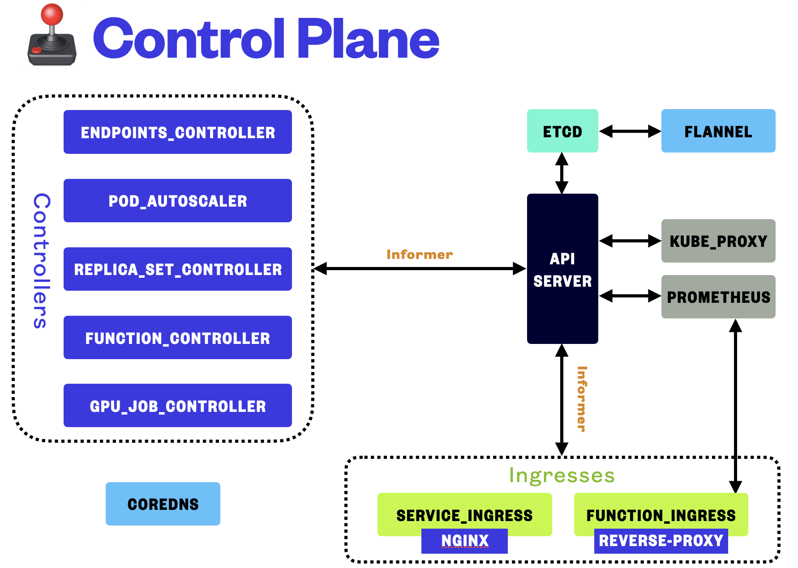

# rMiniK8s

A simple dockerized application management system like [Kubernetes](https://kubernetes.io/), written in Rust, plus a simple FaaS implementation.

Course Project for SJTU-SE3356, 2022.

## Features

- Nodes
    - Registration and status update
    - Label modification
- Pods
    - Multiple containers inside single pod
    - Shared volumes
    - Resource limits
    - Round-robin scheduling over multiple nodes with node selector support
    - Query logs and attach shell
- Services
    - Round-robin load balancing
    - Overlay network over multiple nodes
- ReplicaSets
    - Reconciliation to desired replicas count
- Horizontal Pod Autoscalers
    - Horizontal autoscaling based on CPU/Memory metrics
    - Scale policy and behavior
- Ingresses
    - Connect to services via domain name
    - Routing based on URL path
- GPU Jobs
    - Submit CUDA jobs to HPC server and return results
- Fault Tolerance
    - Pod containers auto recovery
    - Re-synchronization after API server restart
- Serverless (FaaS)
    - Scale-to-zero and horizontal autoscaling
    - Function workflow with conditional branch
- rKubectl
    - Create, get, describe, patch and delete
    - Shell auto-completion

## Architecture Overview

Refer to [Document](assets/Doc.pdf) and [Presentation](assets/Pre.pdf) for further information.

## Getting Started

### Using Automation Scripts

Use `./scripts/ARCH/master/up.sh` to deploy the control plane and `./scripts/ARCH/node/up.sh` to deploy a node. Only ARM architecture is supported and tested currently.

P.S. You may want to build the dependencies(docker images, binaries) and set up a local registry first. Refer to the script for further information.

### Manually

Manual deployment works on both x86 and Arm architecture, and allows you to test only part of the components and features.

First of all, build all components using `cargo build`, and deploy a [etcd](https://etcd.io/) server, then start [API Server](api_server) using `cargo run -p api_server`. You can find help on [rKubectl](rkubectl) using `rkubectl help`. Configuration file templates and example resource definitions are available under [examples](examples) directory.

Now, deploy the components needed based on the following rules:

- For actions related to pods, [Scheduler](scheduler) and [rKubelet](rkubelet) are needed
- For actions related to services, you'll need [Endpoints Controller](controllers/src/endpoints), [rKube-proxy](rkube_proxy)
- For ReplicaSets to work, [ReplicaSet Controller](controllers/src/replica_set) is needed
- To operate a cluster with multiple nodes, [Flannel](scripts/arm/master/up.sh#L13) is needed
- To support Pod autoscaling (including function autoscaling), you need to run [cAdvisor](https://github.com/google/cadvisor) on worker node and [Prometheus](https://prometheus.io/) on control plane node, then start [Pod Autoscaler](controllers/src/podautoscaler)
- [Ingress Controller](controllers/src/ingress) is needed for Ingresses to work
- [GPU Job Controller](controllers/src/gpu_job) is needed to run GPU jobs
- To run functions and function workflows, you need to deploy [Function Controller](controllers/src/function) and [Serverless Router](serverless/src/router)
- You'll need extra configuration on local DNS for domain-based requests to work (Ingress and Serverless), refer to [configuration templates](scripts/arm/master/dns) and automation scripts for details

## License

This project is licensed under the [GPL license].

[GPL license]: https://github.com/markcty/rMiniK8s/blob/main/LICENSE
